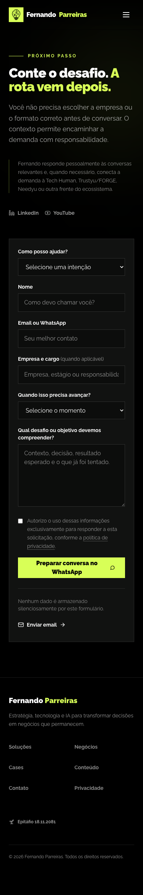

# QA local — tranche final P1

Data: 23 de agosto de 2026

Branch: `codex/final-p1-hardening`

Estado: `VERIFIED` localmente; ainda não `OPERATING` em produção.

## Gates executados

- `npm test`: 27/27 testes aprovados;
- `npm run lint`: aprovado;
- `npm run build`: aprovado, 14 rotas estáticas;
- `npm audit --omit=dev`: 0 vulnerabilidades;
- `git diff --check`: aprovado;
- Netlify Dev: redirect Academy, gate de artigos e headers validados;
- Playwright: desktop 1440x900 e mobile 390x844, sem warnings/erros de console.

## Evidências

### Home — desktop 1440x900

- título, canonical, `og:image` e Twitter Card corretos após hidratação;
- exatamente um `h1`;
- overflow horizontal: `0px`;
- console: 0 erros e 0 warnings.

### Contato — mobile 390x844

- CTA comercial fixo removido da própria rota de contato;
- exatamente um `h1`;
- overflow horizontal: `0px`;
- console: 0 erros e 0 warnings.

### Netlify local

- `/academy/ia-sem-confusao` → `301` para a Tech Human;
- `/academy/ia-sem-confusao/` → `301` para a Tech Human;
- `/artigos/` → `404` enquanto o gate editorial permanece fechado;
- CSP, `X-Frame-Options`, `X-Content-Type-Options`, `Referrer-Policy` e `Permissions-Policy` presentes.

### Privacidade após hidratação

- canonical único: `https://fernandoparreiras.com.br/privacidade/`;
- título e descrição iguais ao HTML estático;
- exatamente um `h1` e overflow horizontal `0px`.
